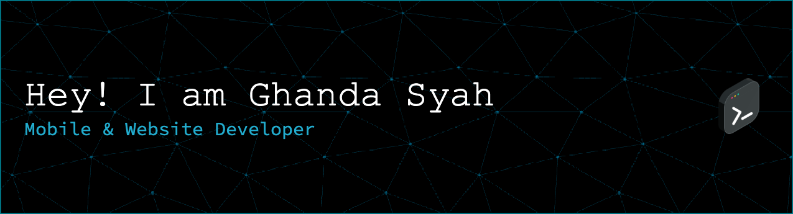

  

  💻 <b>Mobile & Web Developer</b>  
  🚀 I build useful digital products (not just experiments)

  

---

## 🧠 About me

I don't like over-engineering things.  
my focus is simple: build products that actually solve real-world problems.

*simplicity over complexity. readable code over clever one-liners.*

- 🔭 **currently working on:** [Asia Quest Indonesia](https://aqi.co.id/)
- 🌍 **personal website:** [ghanda-syah](https://ghanda-syah.web.app/)
- 🌱 **currently learning:** system design & product thinking
- 💬 **ask me about:** flutter, clean architecture, local database, sync systems
- ⚡ **fun fact:** sometimes I spend more time designing data structure than writing the code 😄

---

## 🧰 Tech stack I use

### 📱 Mobile & Frontend

  

### ⚙️ Backend & Database

  

### 🛠 Tools & Infrastructure

  

---

## 🤝 Let's build something

if you're building something useful and need a developer  
or want to scale an existing product — i'm open to collaborate.  
shoot me an email at **[ghanda.syah@gmail.com](mailto:ghanda.syah@gmail.com)** or reach out via my socials 👇

 

  
  

---

  <i>keep it simple. keep it useful.</i>

